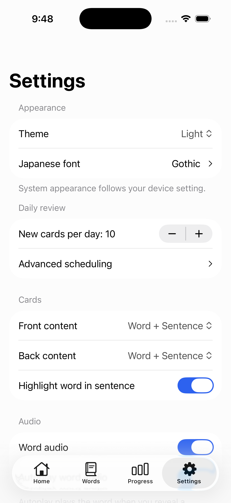
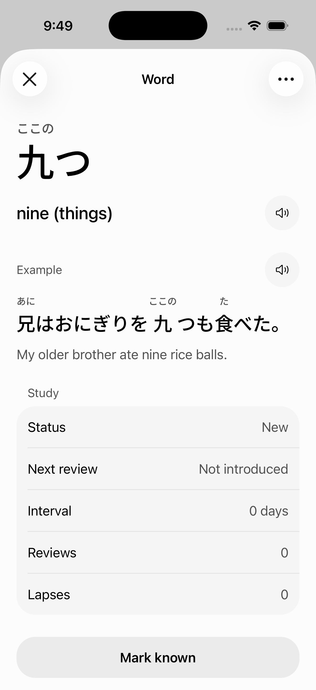
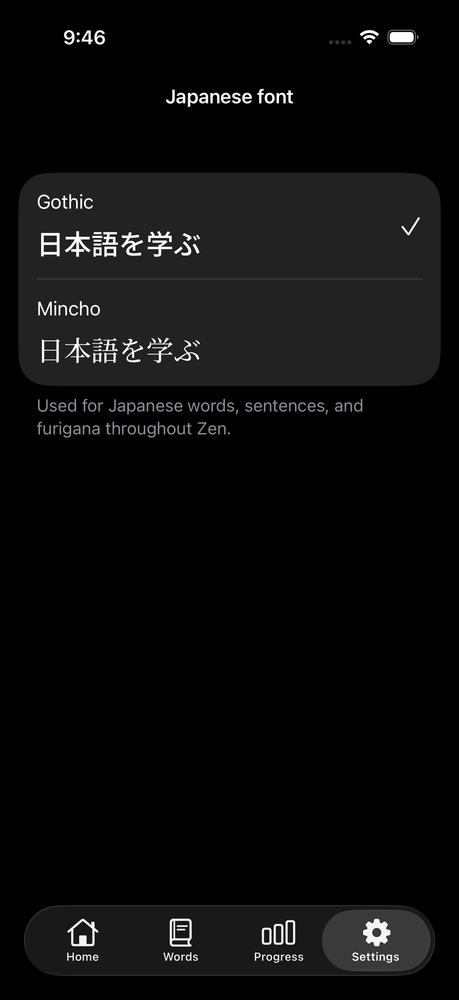
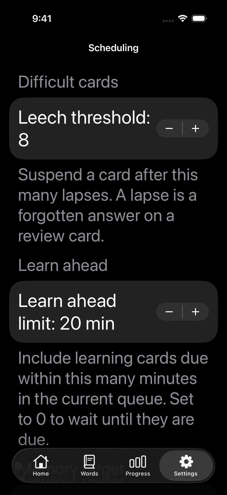
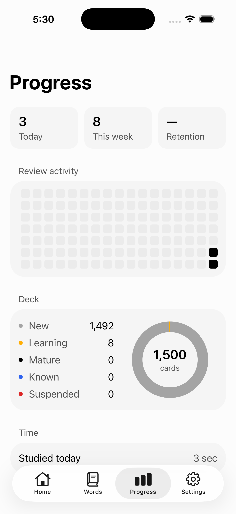

# Native iOS UI review

Simulator captures from Expo Go SDK 57 on iPhone 17 Pro, iOS 26.5. Settings,
Word Detail, and Progress below use the light palette; the Japanese font preview
uses the dark palette. Scheduling shows the iOS Accessibility Large text setting.

| Settings | Word Detail |
| --- | --- |
|  |  |

| Japanese font | Larger accessibility text |
| --- | --- |
|  |  |

| Progress |
| --- |
|  |

Progress stays in React Native rather than SwiftUI because the heatmap and donut
have no Expo UI equivalent. Its empty heatmap cells and the "new" deck segment use
colors that stay visible on the grouped container in dark mode, where the container
matches the old `secondary` fill.

Rendering was checked through simulator deep links and screenshots, including
both light and dark Settings, Word Detail, and Progress, plus Progress at
Accessibility Large where the metric tiles stack vertically. The simulator's original theme and
text-size preference were restored after inspection.

Touch automation was unavailable. Menu selection, swipe dismissal, audio
playback, reset confirmation flows, VoiceOver, reduced transparency, smaller
phones, and Android device behavior still need a manual pass. The Android
production bundle compiled successfully. An iPad run reached Expo Go's initial
Open confirmation, which could not be completed without touch automation, so
no iPad layout verification is claimed.
